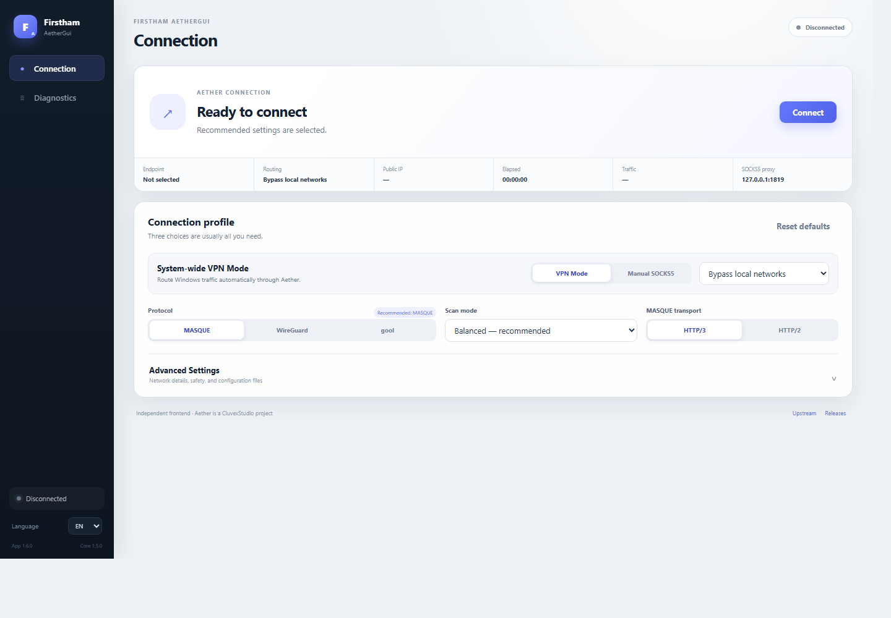

# Firstham AetherGui

Firstham AetherGui is an independent Windows desktop client for the official [CluvexStudio/Aether](https://github.com/CluvexStudio/Aether) networking core. Version 1.6.0 bundles the verified Aether 1.5.0 core and provides system-wide VPN routing or a local SOCKS5 proxy through a focused Tauri interface.

[Persian documentation](README.fa.md) | [Releases](https://github.com/hamvex/AetherGUI/releases)



## What's new in 1.6.0

- Redesigned the application around two focused views: **Connection** and **Diagnostics**.
- Removed the welcome wizard, About page, and built-in documentation navigation.
- Moved secondary network, routing, safety, and configuration controls into collapsed Advanced Settings.
- Upgraded the checksum-verified Aether sidecar from v1.2.0 to v1.5.0.
- Added Ironclad verified-tunnel scanning and configurable Aether log levels.
- Included upstream tunnel leak fixes, dead-tunnel detection, TLS certificate pinning, and routing-rule support through the current core.
- Preserved complete English/Persian localization, RTL layout, tray controls, VPN recovery, and diagnostics.

## Features

- System-wide Windows VPN mode using a checksum-verified sing-box 1.13.14 TUN engine.
- Full tunnel, local-network bypass, and executable-based split tunneling.
- DNS leak protection, explicit IPv6 tunneling or blocking, and an optional session kill switch.
- Manual SOCKS5 mode at `127.0.0.1:1819` for applications that support a proxy directly.
- MASQUE over HTTP/3 or HTTP/2, WireGuard, and gool / WARP-in-WARP.
- Turbo, Balanced, Thorough, Stealth, and Ironclad endpoint scanning.
- Protocol-specific obfuscation, custom endpoints, configuration files, and reconnect controls.
- Live logs with selectable Error, Warning, Info, Debug, and Trace verbosity.
- Cloudflare connection self-test, public IP reporting, and Windows network recovery.
- Single-instance protection, localized system tray actions, and clean sidecar shutdown.

## Download

Download the latest files from [GitHub Releases](https://github.com/hamvex/AetherGUI/releases):

- `Firstham AetherGui_1.6.0_x64-setup.exe`: recommended Windows installer.
- `Firstham AetherGui_1.6.0_x64_en-US.msi`: MSI deployment package.
- `Firstham_AetherGui_1.6.0_x64-portable.zip`: portable executable and required sidecars.
- `SHA256SUMS.txt`: SHA-256 hashes for release verification.

Windows 10/11 x64 is supported. Published binaries are currently unsigned and may trigger Microsoft Defender SmartScreen.

## Using the app

1. Keep **VPN Mode**, **MASQUE**, **Balanced**, and **HTTP/3** selected for the recommended configuration.
2. Select **Connect** and approve the narrowly scoped Windows elevation request used to create the TUN adapter.
3. Wait for the Connected state. The status panel displays the endpoint, routing mode, elapsed time, public IP, and proxy address.
4. Open **Diagnostics** to run the self-test or inspect live Aether and routing logs.
5. Select **Disconnect** to stop Aether and restore the Windows routing state.

Use Manual SOCKS5 mode when only selected proxy-aware applications should connect through Aether. Configure those applications with host `127.0.0.1` and port `1819`.

## Architecture

The GUI does not duplicate Aether's scanning, tunnel, obfuscation, identity, or SOCKS5 implementation. It runs the verified official core as a hidden supervised sidecar and maps validated settings to documented Aether environment variables.

- `src/`: dependency-free HTML, CSS, JavaScript, localization, and frontend assets.
- `src-tauri/src/settings.rs`: settings validation, persistence, and Aether environment mapping.
- `src-tauri/src/process.rs`: core lifecycle supervision, status parsing, watchdog, and logs.
- `src-tauri/src/routing.rs`: elevated TUN routing, split tunneling, DNS handling, and recovery.
- `scripts/fetch-aether.ps1`: downloads and checksum-verifies Aether 1.5.0.
- `scripts/fetch-routing-engine.ps1`: downloads and verifies the pinned sing-box release.
- `.github/workflows/release.yml`: tests, Windows builds, installer packaging, and tagged releases.

## Safety notes

The GUI remains unelevated during normal operation. Windows elevation is requested only for the routing helper that creates the virtual adapter and applies routes.

The kill switch is session-scoped. It keeps strict TUN routing active while Aether reconnects, but it is not a persistent boot-time firewall. After an interrupted session, use the Diagnostics **Repair network** command or run:

```powershell
aether-gui.exe --repair-network
```

TLS validation remains enabled. GUI input is not executed through a command shell. Settings contain paths and connection preferences, not Aether private keys or certificates. A non-loopback SOCKS5 listener requires explicit risk acknowledgement.

## Development

Requirements: Windows 10/11 x64, Node.js 20+, Rust stable with the MSVC target, Visual Studio C++ Build Tools, and WebView2.

```powershell
npm ci
npm run fetch:core
npm run fetch:routing
npm test
cargo test --manifest-path src-tauri/Cargo.toml --locked
npm run dev
```

Production build:

```powershell
npm run build
```

The executable is generated at `src-tauri/target/release/aether-gui.exe`. Installer bundles are generated under `src-tauri/target/release/bundle/`.

## License and trademark

Firstham AetherGui is licensed under GNU AGPL v3.0. Aether is developed by CluvexStudio and remains the networking engine. This repository is an independent graphical frontend and is not endorsed by CluvexStudio.

The Aether name and branding are governed by the upstream [Aether Trademark Policy](TRADEMARK.md). Derivative clients using the Aether name or branding may require prior written permission from the Aether maintainers.
